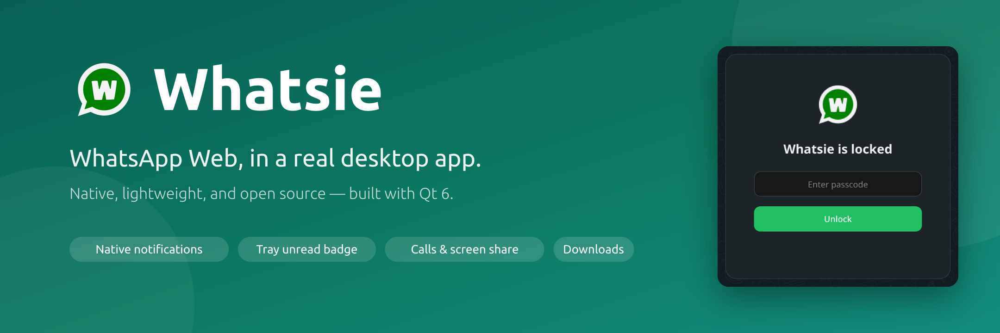
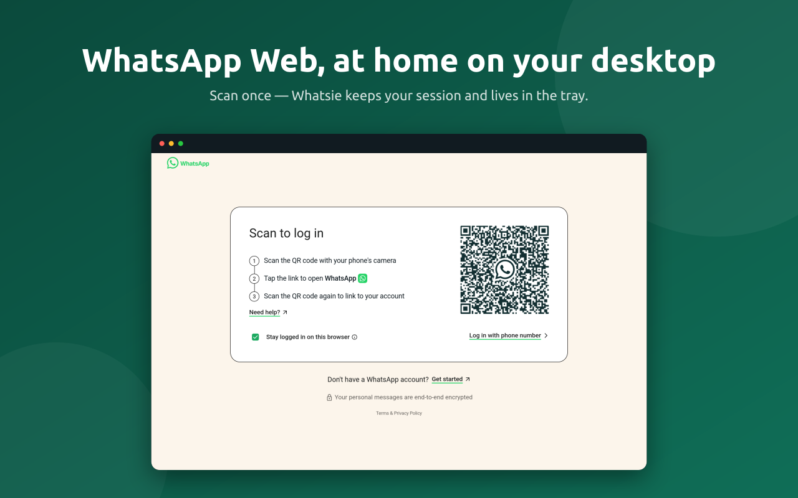
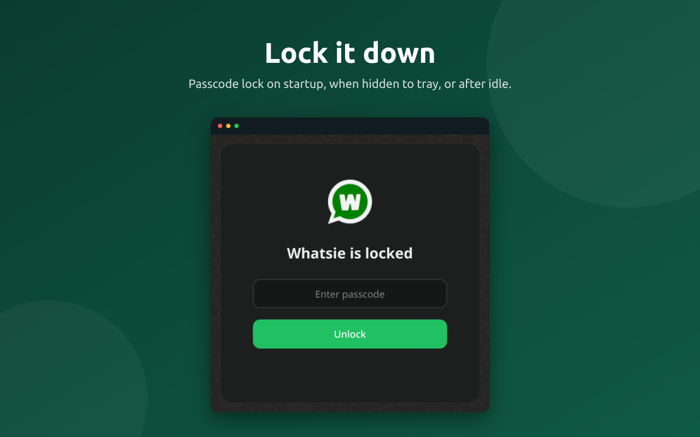
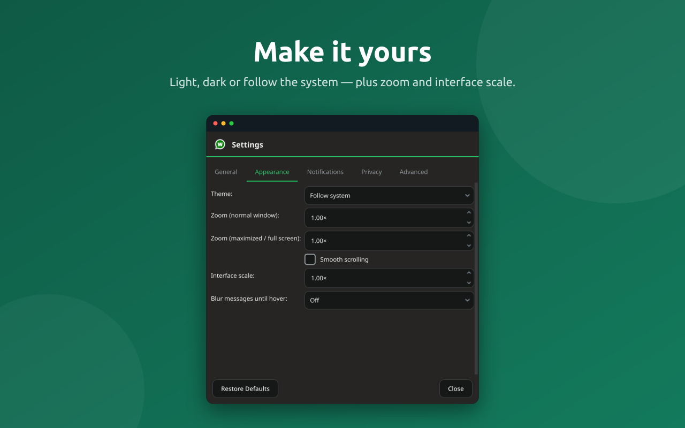
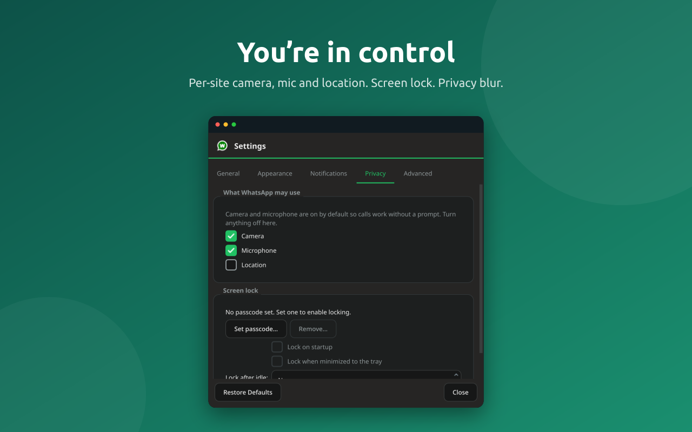
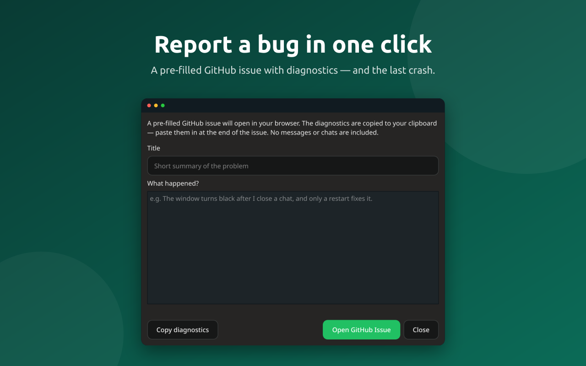
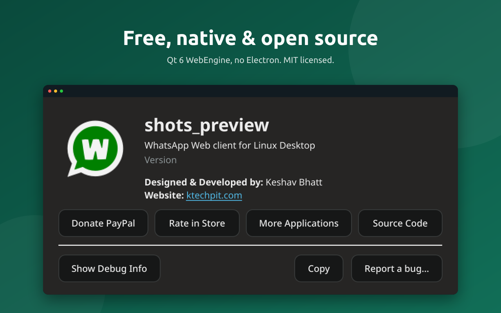

<p align="center">
  
</p>

<h1 align="center">Whatsie</h1>

<p align="center">
  <b>WhatsApp Web, in a real desktop app.</b><br>
  Native notifications, a tray unread badge, calls and screen share, a real downloads
  manager, themes that follow the page, spell check, a proxy, and an optional app lock —
  lightweight and open source, built with Qt&nbsp;6.
</p>

<p align="center">
  
  
  
  
</p>

---

## Why Whatsie

WhatsApp Web is great, but a browser tab is a poor home for it. Whatsie gives it a real
window: it stays in your tray, tells you when a message arrives, opens your downloads where
you expect them, and gets out of the way. It’s a thin, native shell — **no Electron** — so it
starts fast and stays light.

## Screenshots

<p align="center">
  
</p>

<table>
  <tr>
    <td width="50%"></td>
    <td width="50%"></td>
  </tr>
  <tr>
    <td width="50%"></td>
    <td width="50%"></td>
  </tr>
  <tr>
    <td width="50%"></td>
    <td width="50%"></td>
  </tr>
</table>

## Features

**Desktop integration**
- Native notifications with contact avatars.
- System-tray icon with an unread badge, mute, and do-not-disturb.
- Single instance with `--profile` for multiple accounts; autostart at login.
- `whatsapp:` / `wa.me` links and a `--new-chat` command open straight into a chat.

**The web experience, done right**
- Light / dark / follow-system theming, kept in step with WhatsApp Web.
- Voice, video and screen-share calls (Wayland via the desktop portal), with a reliable
  full-screen exit hint.
- A real downloads window with history; drag-and-drop and paste of attachments.
- Zoom and interface scaling; optional smooth scrolling.
- System-language spell check with suggestions.

**Privacy & control**
- Per-site camera, microphone and location controls.
- Privacy blur to hide message text and media until you hover.
- A passcode **app lock** (PBKDF2) that covers every window and can lock on start, on hide,
  or after idle.
- HTTP / SOCKS5 network proxy with authentication.

**Honest about problems**
- A built-in **Report a bug** flow that pre-fills a GitHub issue with diagnostics — and the
  last crash, if there was one — while keeping your messages private.

## Install

### Linux

<p align="center">
  <a href="https://snapcraft.io/whatsie"></a>
  &nbsp;&nbsp;
  <a href="https://flathub.org/apps/com.ktechpit.whatsie"></a>
</p>

```sh
# Snap — any distro with snapd
sudo snap install whatsie

# Flatpak — from Flathub
flatpak install flathub com.ktechpit.whatsie

# Arch Linux (AUR) — builds from source
yay -S whatsie      # or: paru -S whatsie
```

**AppImage** and a self-contained **`.deb`** (Qt bundled, installs on any modern
Debian/Ubuntu) are attached to the [latest release](https://github.com/keshavbhatt/whatsie/releases/latest).
Make the AppImage executable and run it (`chmod +x whatsie-*.AppImage`); install the deb with
`sudo apt install ./whatsie_*_amd64.deb`.

### Windows (x64)

Download the installer or portable build from the
[latest release](https://github.com/keshavbhatt/whatsie/releases/latest):

- **`whatsie-<version>-x64.msi`** — installer (Start Menu + Desktop shortcuts, in-place upgrades)
- **`whatsie-<version>-windows-x64.zip`** — portable, no install required

Windows 10/11, 64-bit; it bundles its own Qt runtime.

## Build from source

Requires Qt **6.11** (the version shipped by the snap `kf6-core24` runtime and the Flathub
KDE runtime), CMake ≥ 3.21, and a C++20 compiler.

```sh
# Development build against the KDE Qt 6.11 snap SDK (works on any distro)
sudo snap install kde-qt6-core24-sdk kf6-core24
scripts/dev-build.sh --tests    # configure + build + run the test suite
scripts/dev-run.sh              # launch

# …or with a system Qt >= 6.11
cmake -B build -DCMAKE_BUILD_TYPE=RelWithDebInfo
cmake --build build -j
ctest --test-dir build --output-on-failure
```

## Project layout

```
src/core      pure logic (settings, services) — Qt Core only, unit-tested
src/web       WebEngine profile/page/view, injected scripts, the JS↔C++ bridge
src/platform  OS backends behind interfaces (notifications, autostart, files, …)
src/ui        QtWidgets: main window, dialogs, tray, lock screen
src/app       Application object, CLI, single instance
tests/        Qt Test suites (unit + offscreen smoke)
snap/         snap packaging (built in CI)
```

## Contributing

Found a bug? The fastest path is **Menu → About → Report a bug…**, which opens a pre-filled
issue with the diagnostics already attached. Otherwise, open an issue or a pull request —
the test suite runs with `scripts/dev-build.sh --tests`.

## License

[MIT](LICENSE) © Keshav Bhatt

<sub>WhatsApp is a trademark of WhatsApp LLC. Whatsie is an independent client and is not
affiliated with, endorsed by, or sponsored by WhatsApp or Meta.</sub>
